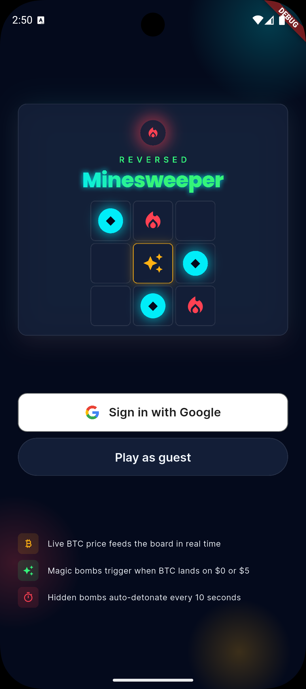
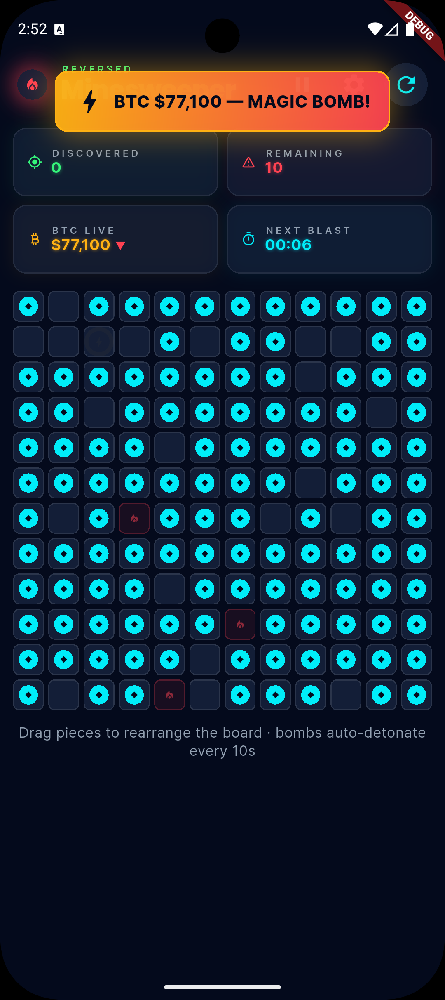
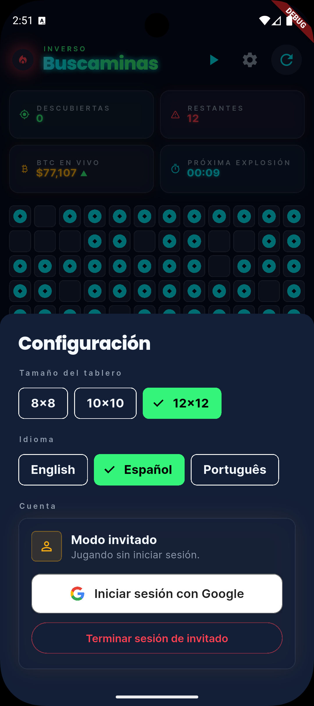
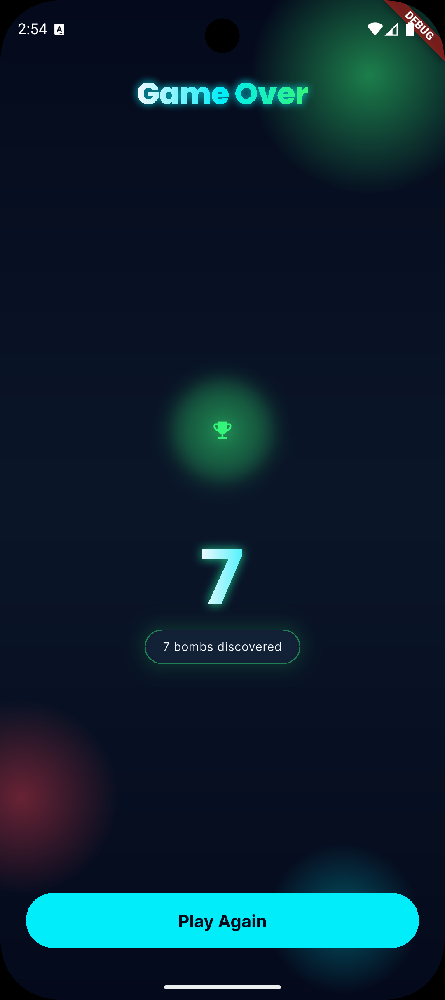

# Reversed Minesweeper

**Idiomas:** [English](README.md) · [Português](README.pt.md) · [Español](README.es.md)

Implementação em Flutter do desafio de código **Reversed Minesweeper**. Os jogadores rearranjam peças pré-colocadas em um tabuleiro para descobrir bombas ocultas antes que o timer as detone. Preços de BTC ao vivo da Binance podem gerar bombas mágicas quando o valor em dólares inteiros exibido **aterrizar** em um número terminado em **0** ou **5**.

<p align="center">
  
  
</p>
<p align="center">
  
  
</p>

---

## Versões do Flutter e Dart

| Ferramenta | Versão |
|------------|--------|
| **Dart SDK** (constraint) | `^3.10.4` |
| **Flutter** (testado) | `3.38.5` stable |
| **Melos** | `^6.3.0` (dev dependency na raiz do repositório) |

Use Flutter 3.38.x ou qualquer release que inclua Dart 3.10.4+. Se você usa [FVM](https://fvm.app/), aponte para um canal stable compatível antes de executar os comandos abaixo.

---

## Início rápido

Coloque os arquivos de config gitignored nos caminhos abaixo antes de executar.

| Arquivo | Local |
|---------|-------|
| `.env` | Raiz do repositório (`sweeper/.env`) |
| `google-services.json` | `android/app/google-services.json` |
| `GoogleService-Info.plist` | `ios/Runner/GoogleService-Info.plist` |

```bash
# 1. Install Melos once (optional — also available via `dart run melos` at repo root)
dart pub global activate melos

# 2. Link local packages and run pub get everywhere
dart run melos bootstrap

# 3. Adicione os arquivos de config (veja a tabela acima)

# 4. Run on a device or simulator (Android / iOS only)
flutter run
```

**Plataformas:** apenas **Android** e **iOS**.

**Internet necessária** para o feed de BTC via WebSocket da Binance.

O app não inicia até que `.env` e os arquivos nativos do Firebase estejam no lugar.

---

## Como jogar

1. **Início** — O jogo carrega um tabuleiro com bombas ocultas e peças pré-colocadas.
2. **Arrastar peças** — Mova peças entre células vazias. Soltar em células ocupadas faz a peça voltar.
3. **Descobrir bombas** — Ao pousar em uma bomba oculta, ela é revelada e o contador de descobertas aumenta.
4. **Timer** — A cada **10 segundos**, uma bomba oculta aleatória detona automaticamente.
5. **Bombas mágicas** — Quando o preço de BTC ao vivo (dólares inteiros, arredondado na UI) **aterrizar** em um valor terminado em **0** ou **5**, uma nova bomba oculta pode aparecer (limitada ao número inicial de bombas daquele tamanho de tabuleiro).
6. **Vitória / game over** — Quando todas as bombas forem descobertas ou detonadas, você vai para a tela de game over com a contagem de bombas descobertas.

### Pausa e configurações

- **Botão de pausa** — Pausa o jogo e exibe o overlay de pausa.
- **Configurações (engrenagem)** — Abre a folha inferior (tamanho do tabuleiro, autenticação). O jogo pausa silenciosamente em segundo plano.
- **Tamanhos do tabuleiro** — 8×8, 10×10 (padrão) ou 12×12 nas Configurações. A escolha é **persistida** entre reinícios do app.

### Autenticação e modo convidado

| Cenário | Comportamento |
|---------|---------------|
| **iOS** | Google Sign-In obrigatório para jogar (sem modo convidado). |
| **Android** | Google Sign-In **ou** **Jogar como convidado** (sem conta). |

O modo convidado é resolvido na inicialização via `AppAccessConfig` (flag exclusiva do Android).

---

## Arquitetura

Monorepo Melos: um **app shell** na raiz do repositório mais **pacotes locais** em `packages/`. Cada pacote é um módulo Dart/Flutter separado com seu próprio `pubspec.yaml` e testes quando aplicável.

```
sweeper/                          ← App shell (android/, ios/, lib/)
├── lib/
│   ├── main.dart                 ← Env load, Firebase bootstrap, DI, runApp
│   ├── app.dart                  ← MaterialApp, BlocProviders (cubits), theme, l10n
│   └── core/
│       ├── config/app_env.dart   ← `.env` → FirebaseOptions (gitignored secrets)
│       ├── firebase/             ← FirebaseBootstrap
│       ├── di/injection.dart     ← get_it (services/repos)
│       └── router/               ← go_router, AuthRedirect, AppPaths
├── packages/
│   ├── sweeper_theme/            ← Design tokens, AppTheme, shared widgets + SVG assets
│   ├── sweeper_l10n/             ← JSON translations + easy_localization loader
│   ├── sweeper_auth/             ← Firebase/Google auth, session, login UI
│   ├── sweeper_settings/         ← Preferences (domain, data, presentation)
│   └── sweeper_game/             ← Game domain, data, presentation
├── .env                          ← Gitignored
├── melos.yaml
└── pubspec.yaml
```

### Camadas (pacotes de feature)

Os módulos de feature (`sweeper_auth`, `sweeper_settings`, `sweeper_game`) compartilham o mesmo layout de **clean architecture**. Pacotes de infraestrutura (`sweeper_theme`, `sweeper_l10n`) são utilitários compartilhados sem essa divisão; o **app shell** apenas inicializa o app (env, Firebase, DI, roteamento).

```
packages/<feature>/lib/
├── domain/
│   ├── entities/           # Value types — no Flutter imports
│   ├── repositories/       # Abstract contracts
│   └── services/           # Pure logic orchestrators (where needed)
├── data/
│   ├── datasources/        # Firebase, SharedPreferences, WebSocket, …
│   ├── dtos/               # Wire / JSON shapes (where needed)
│   └── repositories/       # Implements domain contracts
└── presentation/
    ├── cubit/              # UI state
    ├── pages/              # Full screens
    └── widgets/            # Composable UI
```

| Camada | Responsabilidade | Exemplos (entre pacotes) |
|--------|------------------|--------------------------|
| **Domain** | Regras de negócio, modelos, interfaces de repositório — **sem I/O** | `GameEngine`, `UserSettings`, `AuthUser`, `AuthRepository`, `SettingsRepository` |
| **Data** | Comunicação com o mundo externo; mapeia DTOs → tipos de domínio | `FirebaseAuthDataSource`, `SharedPreferencesSettingsDataSource`, `BinanceWebSocket`, `*RepositoryImpl` |
| **Presentation** | Widgets + Cubits; dirige a UI a partir de domain/data | `GameCubit` / `GamePage`, `AuthCubit` / `LoginPage`, `SettingsCubit` / `SettingsSheet` |

Regra de dependência: **presentation → domain ← data**. A camada de presentation nunca importa datasources diretamente; o app shell registra implementações concretas no `get_it` (`lib/core/di/injection.dart`).

Código transversal fica ao lado das três pastas quando atravessa features — por exemplo `sweeper_auth/session/` (ciclo de vida convidado/login) e `config/` (flags de acesso por plataforma).

Gerenciamento de estado: **Cubits** (`flutter_bloc`) — registrados na árvore de widgets via `MultiBlocProvider` em `app.dart`. Navegação: **go_router** com paths tipados em `AppPaths` (`lib/core/router`). DI: **get_it** para services/repos singleton.

---

## Dependências (visão geral)

### App shell (`pubspec.yaml`)

| Pacote | Propósito |
|--------|-----------|
| `firebase_core` | Inicialização do Firebase |
| `flutter_dotenv` | Carrega `.env` em runtime |
| `flutter_bloc` | Provedores de Cubit |
| `get_it` | Injeção de dependência (services/repos) |
| `go_router` | Roteamento declarativo |
| Pacotes locais `sweeper_*` | Veja os módulos acima |

### Dependências transitórias / por pacote

| Pacote | Módulo | Propósito |
|--------|--------|-----------|
| `web_socket_channel` | `sweeper_game` | WebSocket da Binance |
| `firebase_auth`, `google_sign_in` | `sweeper_auth` | Google Sign-In |
| `flutter_svg` | `sweeper_theme` | Asset do logo Google |
| `equatable` | game, auth, settings | Igualdade de valores |
| `easy_localization` | App + `sweeper_l10n` | Strings `.tr()`, traduções JSON |

---

## Fluxo de desenvolvimento (Melos)

Todos os comandos são executados na **raiz do repositório**:

```bash
dart run melos bootstrap      # pub get + link path packages (run after clone or pubspec changes)
dart run melos analyze        # dart/flutter analyze in every package
dart run melos test             # flutter test in packages that have test/
dart run melos run format       # dart format all packages
```

---

## Testes

**119 testes** (unit/widget) no monorepo — game engine, cubits, settings, auth, roteamento e widgets.

```bash
dart run melos test
```

### Cobertura

| Escopo | Linhas |
| --- | --- |
| **Geral** (todo `lib/` sob teste) | **87,3%** (751/860) |
| **Lógica central** (domain, data, cubits, session) | **97,7%** (589/603) |

Medido pela fusão de `coverage/lcov.info` de cada pacote com testes (app shell, `sweeper_auth`, `sweeper_game`, `sweeper_settings`, `sweeper_theme`).

```bash
dart run melos exec --dir-exists=test -- flutter test --coverage
# then merge the five lcov files (requires lcov):
lcov --add-tracefile coverage/lcov.info \
     --add-tracefile packages/sweeper_auth/coverage/lcov.info \
     --add-tracefile packages/sweeper_game/coverage/lcov.info \
     --add-tracefile packages/sweeper_settings/coverage/lcov.info \
     --add-tracefile packages/sweeper_theme/coverage/lcov.info \
     --output-file coverage/merged.info
lcov --summary coverage/merged.info
```
